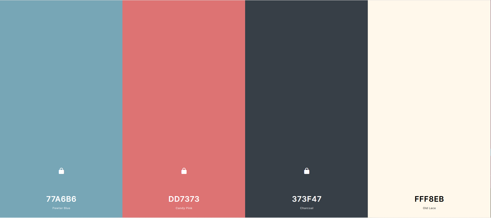
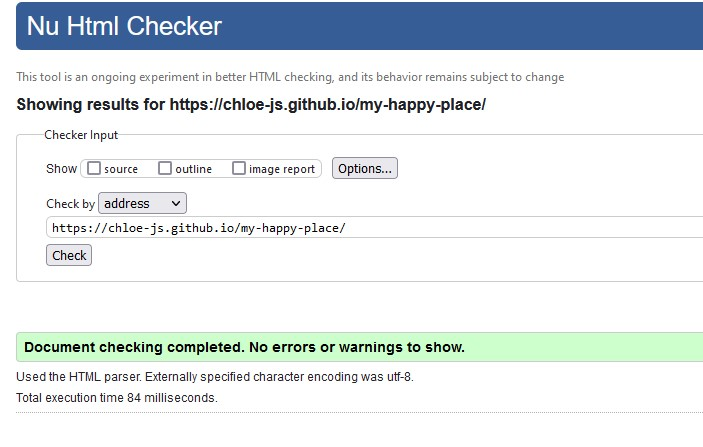

# project name - 'my-happy-place'
## using mind and body self-improvement techniques

The purpose of this project is to Build a Meditation/Mindfulness/Yoga Website. The External user’s site goal is for users that are interested in learning body/mind self-improvement techniques and the Site owner's goal is to teach users specific body/mind self-improvement techniques.

## UX
The UX for this project will be investigated through the following five planes:
Strategy Plane:

### Business goals?
The Site owner's goal is to teach users specific body/mind self-improvement techniques

### Why are we special?  
There are several other yoga and meditation sites such as 'Head Space' and you tube where the user can search for any type of yaoga or meditation video they want.
Our advantage is that we take the thinking out of dearching for a video and limiting choices for the best videos avalable and displaying it in a mobile friendly, visually apealing site.

### Tech considerations?
Building for mobile demographic makes our site more accessable for the user at any time as meditation can often be needed in a stressful situation, the user may not have the time to get a computer.

### Why would a user want this?
We not only ooffer the links to videos but also an opportunity to socialise and meet up with a community of like minded individuals. w=We connect users with the choice to come into the studio by contacting the studio and setting up a consultation or to enquire more on yago and meditation time tables.

### Who is my target audience?
Target audience are users that are interested in learning body/mind self-improvement techniques from the convience of their home.

### What's worth doing?
adding links to yoga and meditation videos. 
Meditation How to, details on preparing self for a guided meditation.
creating a form to be submitted with user information to contact the studio for a consultation or to enquire more about the studio yoga and meditation classes.
keeping the site minimal and clean to keep the user in a state of calm while using the site.
keeping a neatral light and calm colour pallet to instill a sense of calm for the user.

Will it add value, and what value will it add? Who's our target audience? Who is our demographic, or our demographics?
Our target audience is most likely females aged from 25-35 entering into full time work with stressful jobs which limits the amount of time spent on themselves and creates a highly stressed and sleep deprived user.  having calming feminan color pallet puts the user at ease for the end of the day. short yoga videos and meditation techniques prepare the user to be one click away from 'their happy place'. Also encoraging a meet up or consultation session give the user a sense of community and normality, that there is someone there who will listen if needed and there is a place that they can feel comfortable to escape to if nessesary.

## Scope Plane:

### Whats on the table?
Most important features at this stage in no particular order are as follows:

    Home navigation,
    How to meditate,
    Meet up or consulation contact,
    Links to videos,

Having a calming relaxing home page is the first thing the user will see when opening our site. this should be a warm and welcoming front page, I would like to keep with a rounded edge theme and limiting sharp or hard edges on my images as it is a lot more relaxing style choice. but having more then one image as a circle can be tricky esecially when there are 3 objects involved. I have need to do something else other then float in order to achieve this. 
I have chosen to go with flex box to help with the alignment and responsivness of my opening page as it gives me a must more flexible layout options.

for the navigation bar when the user hovers and selects the tab I want the color from the header to extend down onto the selected heading.

This has caused an issue with the responsive design by having the rounded images. the tab closest to the header colour looks strange with the round edge at the very top. I may need to isolate this tab in the Media quer, if I have the time to play with it.

I could include have more videos but the css would be the same and more videos for yoga classes can be added at any time

--Key milestones:

    Having Header Complete (for mobile and desktop)
    Footer complete (mobile and desktop)
    Why do muay thai section complete and optimized
    Schedule Section complete and optimized
    FAQ section complete and optimized
    Testimonial section complete and optimized
    Gallery page with implementation of hover feature complete and optimized
    Contact Us and form complete and optimized (including message showing there submission has been accepted)
    Test and Review

--User story/s:

    As a new member I want to know if joining a Muay Thai gym is for me.

    As new member I want to make an informed decision if this gym is the right choice.

    As a new user I want to know where the gym is.

    As a new user I want to know what time the classes are on.

    As a new user I want to know what is the pricing involved.

    As a new user I want to know what the contact information is for any follow up questions.

    Secondly (but just as important) the user wants to know if joining the gym is going to be worth doing, therefore the site needs to be engaging immediately highlighting the fun, toughness and dedication it takes to train muay thai. Also highlighting what Muay thai is.

    As an existing member I want to know what the schedule times are.

    As an existing member I want to know what the opening hours are.

    As an existing member I want to know what the contact information is.

    As an existing member I am on the go and have a million and one different commitments. Therefore when I come to site it will most likely be on mobile.

    When I come to the site, all this information needs to be easily obtainable.

## Structure Plane:

Information architecture:
To keep our navigation minimal we will have 4 pages and use a responsive navigation to link between them

Index (happiness) > Mind (Meditation) > Body (yoga) > Soul (Get in touch)

Principles of Organization:

    Our site is an escape from the munade work load of modern sociaty. not every one hass the time to go to a gym or yoga studio. Not everyone has the time to sift through countless youTube videos too find a good quick class to help de-stress or to sleep better. We take out the thinking of relaxing and create a relaxed calming enviroment that when someone (most likely a woman) opens up the site, they are already calming down from their day and they can select a good video to play inthe background while they unwind from their day.
    We do offer a cconnection for when they have a chance where they can either go to a yoga class or schduel a consult with a someone to speak to.
    Further information can be found about the studio or the people through the social media sites at the footer if the user wants to explore more.

## Surface plane:

Font: Will be a mix of “Alice” and “Sacramento” a good paring suggesion from 'https://www.pagecloud.com/blog/best-google-fonts-pairings' for comparable and complementary fonts

Color: Primary color will be calm, feminine and relaxing. Secondary will be contrasted as bold but saturated to create a readable contrast for important items and the background will be complementary to both the primary and secondary colors. Color scheme was decided using 'https://coolors.co/77a6b6-373f47-dd7373-fbf2c0'. at irst test there was a contasting issue with the colors chosen but we have now changed the background color to creat more of a contract.

Images have all been selected from 'https://unsplash.com/' a copy right free image site.

Video links are all from YouTube

- navigation bar change from underline simple style to color overlap 
- issue naming conventions for css classes
- trouble directly targeting certain elements, confusion at which point css proporties affected elements between parent and child elements
- setting up, parent and child elements and assigning content proporties and container proporties
- dealing with element hights and width, opposed to padding and margin
- correctly utilising images without the img element
- simplist non descriptive class names need to be refactored
- final clasrification on circle creating radius
- submit button needed to be isolated with style
- responsiveness from mobile to desctop needed to change spacing to make style look better
- need to refactor css proporties with classes to maintain as day code as possible
- add a enquire more at the bottom of mind and body page to link to contact us page

# Testing

## HTML validation

line 102 : incorrect attribute value, <script src-= written twice>, incorrect src spelling
line 40 : lack of headings
line 68 : lack of heading definition 

## CSS validation

## Lighthouse validation

utilise lighthouse reports to ensure sufficient use of code and best practices have been applied regarding SEO, Best Practice, Accesssiblity, Performance